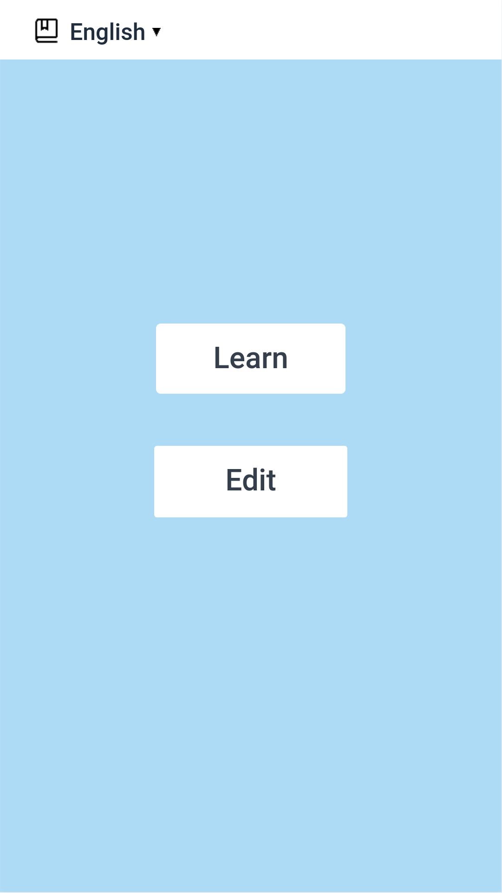
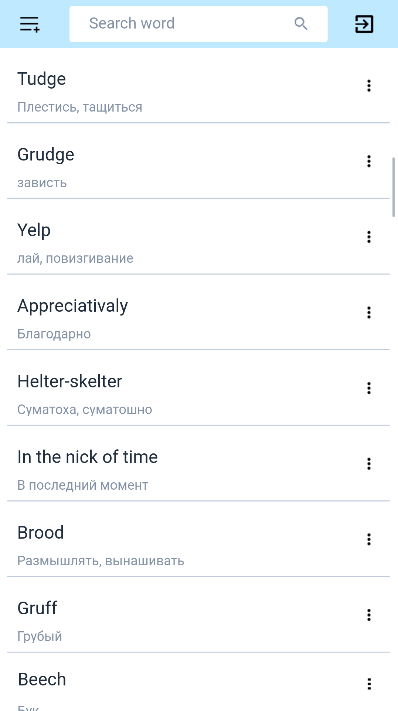

# Overview
<!--  -->

This is a mobile app for studying flesh-cards. Main goal for this project is to make a basic application, where user can generally do two things:
- Swipe cards to segregate them into learned and unlearned piles
- Manage cards dictionary: add, delete, amend cards.

## Main window

Here user can choose two options:
1. Switch to "Study screen". This screen contains flesh-cards,
2. Switch to "Dictionary screen", where user can edit dictionary.

## Study window

This window should provide opportunity for study current dictionary.

## Dictionary window

On this screen all amending and observing actions can be done.
