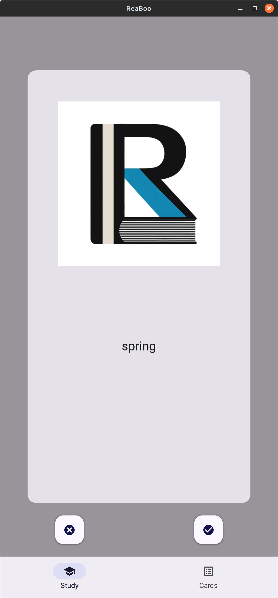

# Connected links

* Mindmap - [GitMind](https://gitmind.com/app/docs/mkgt1xiu)
* Database design - [DrawSQL](https://drawsql.app/teams/pupsy/diagrams/reaboo)
* Color palette - [Atmos](https://app.atmos.style/66c371d6cdbfbc09b873f826)
* UI design - [Marvel](https://marvelapp.com/project/7011111)


# Installation

Choose folder on your computer, where you want to have this repository. 
The use next command to clone it:

```
git clone https://github.com/ruslkhay/ReaBooKivyMD.git
```

Install PDM package manager and run:

```bash
curl -sSL https://pdm-project.org/install-pdm.py | python3 -
pdm install
```

In order to run formatting and linting manually use one of the following commands:

```bash
pre-commit run --files file.py
pre-commit run --all-files
```


# Overview
<!-- [](https://travis-ci.org/joemccann/dillinger) -->

This is a mobile app for studying flash-cards. Main goal for this project is to make a basic application, where user can generally do two things:
- Swipe cards to segregate them into learned and unlearned piles
- Manage cards dictionary: add, delete, amend cards.

## Main window


Here user can choose two options:
1. Switch to "Study screen". This screen contains flash-cards,
2. Switch to "Dictionary screen", where user can edit dictionary.

## :technologist: Study window


This window should provide opportunity for study current dictionary.

## :memo: Dictionary window


On this screen all amending and observing actions can be done.
