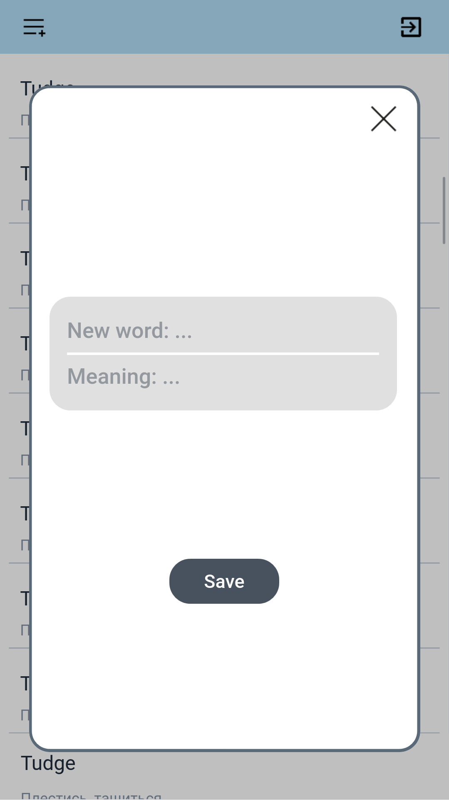

Application components
======================

This section describes integral interface components of application. 

Usage
-----
Main screen consists of two buttons:
* Learn - redirect onto screen with flesh-cards games,
* Edit - redirect onto screen with dictionary.

.. figure:: _static/main.png
       :scale: 50 %
       :align: center
       :alt: Альтернативный текст

       Main screen
       
.. attention:: Section "Learn" is not implemented. So button doesn't work.

Pressing "Edit" button you'll be redirected onto dictionary screen. Here you
can add, delete and look up words and their translations. 

.. figure:: _static/dict_list.png
       :scale: 50 %
       :align: center
       :alt: Альтернативный текст

       Dictionary screen

On the top right corner "go back" button is located. It will return you back to 
the main window.

On the top left corner "add new word" button is located. Press it and pop-up 
card appears. While card's inputs are incorrect "Save" button is locked.

       Pop-up card

Interface components
--------------------

.. automodule:: main
   :members: 
